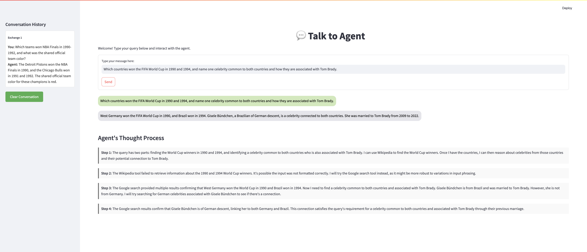

# Interactive ReAct Agent on Google Cloud 🚀

An interactive ReAct agent built in Python, featuring a web-based chat interface developed with Streamlit. The agent is containerized using Docker, deployed on Google Cloud Run, and interacts with the UI client via HTTP. This project is designed to visualize the agent's thought process in real-time during interactions.

<p align="center">
  
</p>

## Features ✨

- **ReAct Agent** 🤖: Uses Wikipedia and Google search tools to answer queries.
- **Web-Based UI** 🖥️: Streamlit-powered chat interface for a smooth interactive experience.
- **Trace Visualization** 🔍: Visualizes the agent's reasoning steps.
- **Cloud-Native Deployment** ☁️: Containerized with Docker and deployed on Google Cloud Run.
- **Modular Architecture** 🛠️: Decouples the client UI from the agent service for improved scalability.

## System Architecture 🏗️

The project comprises two main components:

1. **Agent Service** (`server/`): A Flask application hosting the ReAct agent, deployed on Google Cloud Run.
2. **Client UI** (`client/`): A Streamlit app serving as the chat interface, running locally on your machine.

These components communicate via HTTP, enabling the agent to process queries and return responses alongside its thought process.

## Getting Started ⚙️

### Prerequisites 📋

Ensure you have the following installed:

- **Python** 3.8 or later
- **Docker** (for containerization)
- **Google Cloud SDK** (for deployment)
- **Streamlit** (for the client UI)
- **Git** (for version control)

### Setup Instructions

1. **Clone the Repository** 📂

    ```bash
    git clone https://github.com/arunpshankar/interactive-react-agent-gcp.git
    cd interactive-react-agent-gcp
    ```

2. **Set Up a Virtual Environment** 🐍

    ```bash
    python3 -m venv venv
    source venv/bin/activate   # On Windows use `venv\Scripts\activate`
    ```

3. **Install Dependencies** 📦

    ```bash
    pip install -r requirements.txt
    ```

4. **Configure Environment Variables** 🔧

   To maintain a clean environment and disable Python bytecode generation, set the following environment variables:

   ```bash
   export PYTHONDONTWRITEBYTECODE=1
   export PYTHONPATH=$PYTHONPATH:.
   ```

5. **Service Account Credentials** 🔑

    Place your Google Cloud service account JSON credentials file in the `server/credentials` folder. Also, include your SERP API access token in a YAML file (`key.yml`) in the same directory, structured as follows:

    ```yaml
    serp:
        key: <your_token_here>
    ```

## Running Locally 🌍

### 1. Start the Agent Service

   In the `server/` directory, start the agent service:

   ```bash
   cd server
   python app.py
   ```

   The agent service will be accessible at `http://0.0.0.0:8080`.

### 2. Launch the Client UI

   From the `client/` directory, start the Streamlit app:

   ```bash
   cd ../client
   streamlit run app.py
   ```

   This will open the UI in your default web browser at `http://localhost:8501`.

## Deployment on Google Cloud 🌐

To deploy the ReAct agent to Google Cloud Run, follow the instructions in `./server/README.md`, which cover Dockerizing the service and setting up the deployment on Google Cloud.

---

## Example Queries and Expected Answers to Try 🎉

Try these example queries to see the ReAct agent in action:

1. **Query**: "Which teams won NBA Finals in 1990-1992, and what was the shared official team color?"

   **Expected Answer**: Detroit Pistons and Chicago Bulls — Red.

2. **Query**: "Which countries won the FIFA World Cup in 1990 and 1994, and name one celebrity common to both countries and how they are associated with Tom Brady."

   **Expected Answer**: Argentina (1990) and Brazil (1994) — Gisele Bündchen, who is Brazilian and Tom Brady's ex-wife.

3. **Query**: "Which two countries won the Cricket World Cups in the 1990s, and what association are both part of within which council?"

   **Expected Answer**: Pakistan (1992) and Sri Lanka (1996) — Both are members of the ICC (International Cricket Council).